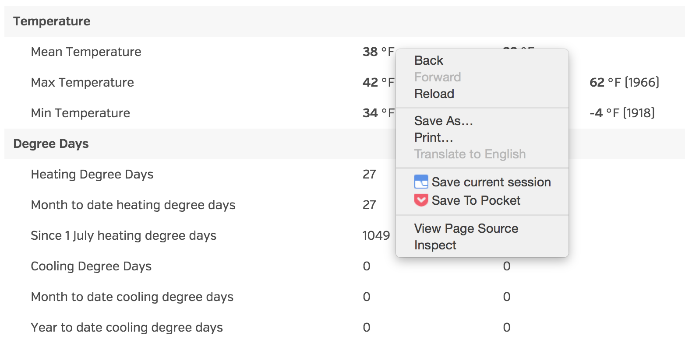
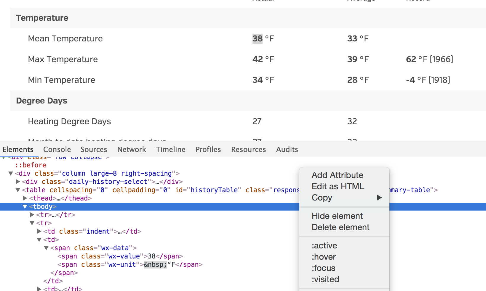

# Data Science Track

Welcome to the data science track! :D <br>
We'll be exploring some weather data to see if we can predict whether it'll rain, so let's get started!

# Level 0: Environment Setup
The first tool we'll need is [pip](https://pip.pypa.io/en/stable/installing/). Once we have that, the following lines will set up the necessary modules:
```
pip install pandas
pip install bokeh
pip install ipython
pip install jupyter
pip install scikit-learn
```
We wrote this curriculum using [Jupyter notebooks](http://jupyter.org/), so there may be some slight finnegaling required (such as omitting `%matplotlib inline` and `bokeh.io.output_notebook()`).

# Level 1: Scraping Data

(Find this notebook hosted [here](http://nbviewer.jupyter.org/github/kl2806/devfest-data-science-track/blob/master/level_1.ipynb).)

In this level, we'll obtain the data we need for future analysis. Data collection is often overlooked, but it's crucial to obtain high quality data without errors.

Data comes in many different forms and from many different sources. For example, you might imagine collecting the most recent posts someone has made on Facebook. Each post would be a *data point* with multiple different *variables* (e.g. the time of the post, or the number of words in the post).

For this project, we'll be analyzing data from the [Weather Underground](http://www.wunderground.com/), a website for weather information.

So, how should we get our data? Well, one way would be to visit the website and copy-paste things into a spreadsheet. But, as you'd imagine, that gets very tedious very quickly. Why not make the computer do it for us?

Using a computer to automatically collect data from websites is called **web scraping**. Certain websites have things called **APIs** which are essentially pages specifically for computers extracting information, but there's still a lot of data locked-up without any APIs.

The Weather Underground actually has an API [available](http://www.wunderground.com/weather/api/), but we'll do it the hard way to show you how web scraping would work in the first place.

To start collecting our data, let's look at a [sample webpage](http://www.wunderground.com/history/airport/KNYC/2016/1/1/DailyHistory.html) that we may extract information from:


The page organizes information into a nice, neat table, which is good for us. Let's dig into this a little more by exploring how the webpage is presenting this information.



Let's right click on the 38$^\circ$, and then press "Inspect". This will allow us to look at the actual HTML code that generated the webpage we're looking at. We can then right click where it says `tbody` and press "Edit as HTML".



This should show you the code of this table, which should look like:

```html
<tbody>
		<tr>
		<td class="history-table-grey-header">Temperature</td>
		<td colspan="3" class="history-table-grey-header">&nbsp;</td>
		</tr>
		<tr>
		<td class="indent"><span>Mean Temperature</span></td>
		<td>
  <span class="wx-data"><span class="wx-value">38</span><span class="wx-unit">&nbsp;°F</span></span>
</td>
		<td>
  <span class="wx-data"><span class="wx-value">33</span><span class="wx-unit">&nbsp;°F</span></span>
</td>
		<td>&nbsp;</td>
		</tr>
		<tr>
		<td class="indent"><span>Max Temperature</span></td>
		<td>
  <span class="wx-data"><span class="wx-value">42</span><span class="wx-unit">&nbsp;°F</span></span>
</td>
		<td>
  <span class="wx-data"><span class="wx-value">39</span><span class="wx-unit">&nbsp;°F</span></span>
</td>
		<td>
  <span class="wx-data"><span class="wx-value">62</span><span class="wx-unit">&nbsp;°F</span></span>
(1966)</td>
		</tr>
```

Here, we're seeing the raw HTML that the website is amde up of. Although it might take some squinting, we can see that each `tr` (table row) represents one variable that we might be interested in.

Now, how much data do we want? To conveniently side-step leap years, let's say we're interested in data between January 1, 2013 and December 31, 2015.

Now, let's think more about what scope of data we want; we probably want at least a couple of years' worth of data. Let's say that we're interested in data between January 1, 2013 and December 31, 2015. Another nice thing about the Weather Underground is the URL structure: the URL for the page above is "http://www.wunderground.com/history/airport/KNYC/2016/1/1/DailyHistory.html" for January 1<sup>st</sup>, 2016. Luckily, it turns out that we can replace the `2016/1/1` with the year, month, and day that we're interested to obtain the right webpage. That means we can start by generating all the URLs we're interested with Python:


```python
days_per_month = {1: 31, 2: 28, 3: 31, 4: 30,
                  5: 31, 6: 30, 7: 31, 8: 31,
                  9: 30, 10: 31, 11: 30, 12: 31}

link_format = "http://www.wunderground.com/history/airport/KNYC/{}/{}/{}/DailyHistory.html"
links = [link_format.format(year, month, day)
         for year in range(2013, 2016) # 2013 - 2015 inclusive
         for month in range(1, 13)     # 1 - 12 inclusive
         for day in range(1, days_per_month[month] + 1)]

print(len(links))
print("\n".join(links[:5]))
```

    1095
    http://www.wunderground.com/history/airport/KNYC/2013/1/1/DailyHistory.html
    http://www.wunderground.com/history/airport/KNYC/2013/1/2/DailyHistory.html
    http://www.wunderground.com/history/airport/KNYC/2013/1/3/DailyHistory.html
    http://www.wunderground.com/history/airport/KNYC/2013/1/4/DailyHistory.html
    http://www.wunderground.com/history/airport/KNYC/2013/1/5/DailyHistory.html


It looks like our code is working! We have exactly 3 year's worth of links (3 * 365 = 1095), which is a nice little sanity check. Now that we have all the links, we can start downloading the webpages using a neat library called `requests`. For speed, we'll combine with Python's `concurrent.futures` module to scrape multiple websites at the same time.

We'll also save all the webpages locally, so that we don't have to keep re-downloading things if we need to redo our analysis.


```python
import requests
import os.path
import concurrent.futures
from tqdm import tqdm    # progress bar

link_to_fname = {link: "{}.html".format(i)
                 for i, link in enumerate(links)
                 if not os.path.isfile("{}.html".format(i))}

with concurrent.futures.ThreadPoolExecutor() as executor:
    futures = [executor.submit(requests.get, link) for link in link_to_fname]
    for future in tqdm(concurrent.futures.as_completed(futures)):
        response = future.result()
        fname = link_to_fname[response.url]
        with open(fname, "w") as fout:
            fout.write(response.text)
```

    

Now, we can use a library called Beautiful Soup to parse and explore the HTML pages:


```python
from bs4 import BeautifulSoup

with open("0.html") as fin:
    soup = BeautifulSoup(fin.read(), "html.parser")
```

Using Beautiful Soup, we can look for particular things on different pages. For example, we can look for the links (`a` tags) on the page.


```python
all_as = soup.find_all('a')
for i in range(5):
    print(all_as[-i])
    print()
```

    <a href="https://www.wunderground.com/member/registration">
    <i class="fi-torso sidebar-icon"></i> Sign Up / Sign In
      </a>
    
    <a aria-label="Close" class="close-reveal-modal">×</a>
    
    <a class="button medium radius" href="/member/registration">Remove Ads</a>
    
    <a class="exit-off-canvas"></a>
    
    <a class="ad-choices" href="/adchoices.asp">AdChoices</a>
    


For the specific data we're looking for, it's all inside of a `table` with `historyTable` as the id. We can also search by id with BeautifulSoup.


```python
main_table = soup.find(id='historyTable')
```

Now we can look for `tr`'s within this table specifically.


```python
rows = main_table.find_all('tr')
print(len(rows))
for i in range(3):
    print(rows[i])
    print()
```

    34
    <tr>
    <th> </th>
    <th>Actual</th>
    <th>Average </th>
    <th>Record </th>
    </tr>
    
    <tr>
    <td class="history-table-grey-header">Temperature</td>
    <td class="history-table-grey-header" colspan="3"> </td>
    </tr>
    
    <tr>
    <td class="indent"><span>Mean Temperature</span></td>
    <td>
    <span class="wx-data"><span class="wx-value">33</span><span class="wx-unit"> °F</span></span>
    </td>
    <td>
    <span class="wx-data"><span class="wx-value">33</span><span class="wx-unit"> °F</span></span>
    </td>
    <td> </td>
    </tr>
    


Once we have an actual row, there's lots of information we can extract. Let's try it with one of the rows.

(We're only interested in the first two cells because those are the row name and value on that day.)


```python
row = rows[2]
for cell in row.find_all('td'):
    print(cell)
    print()
row_name = row.find_all('td')[0].text.strip()  # Get rid of extra whitespace
row_value = row.find_all('td')[1].text.strip()
print(row_name, ":", row_value)
```

    <td class="indent"><span>Mean Temperature</span></td>
    
    <td>
    <span class="wx-data"><span class="wx-value">33</span><span class="wx-unit"> °F</span></span>
    </td>
    
    <td>
    <span class="wx-data"><span class="wx-value">33</span><span class="wx-unit"> °F</span></span>
    </td>
    
    <td> </td>
    
    Mean Temperature : 33 °F


Wonderful! Let's write some code that can do this for all of the rows in the table we had above. 


```python
for row in rows:
    #Only process the rows with 4 cells to eliminate heading rows, etc.
    if len(row.find_all('td')) == 4:
        row_name = row.find_all('td')[0].text.strip()
        row_value = row.find_all('td')[1].text.strip() 
        print(row_name, ":", row_value)    
```

    Mean Temperature : 33 °F
    Max Temperature : 40 °F
    Min Temperature : 26 °F
    Heating Degree Days : 32
    Month to date heating degree days : 32
    Since 1 July heating degree days : 1622
    Cooling Degree Days : 0
    Month to date cooling degree days : 0
    Year to date cooling degree days : 0
    Dew Point : 22 °F
    Average Humidity : 54
    Maximum Humidity : 64
    Minimum Humidity : 44
    Precipitation : 0.00 in
    Month to date precipitation : 0.00
    Year to date precipitation : 0.00
    Snow : 0.00 in
    Month to date snowfall : 0.0
    Since 1 July snowfall : 5.1
    Snow Depth : 0.00 in
    Sea Level Pressure : 29.90 in
    Wind Speed : 7 mph
     (WNW)
    Max Wind Speed : 15 mph
    Max Gust Speed : 26 mph
    Visibility : 10 miles
    Events : 


Whoa! We now have tangible data for January 1<sup>st</sup>. To make things simpler, let's use the 'Mean Temperature', 'Max Temperature', 'Min Temperature', 'Dew Point', 'Average Humidity', 'Maximum Humidity', 'Minimum Humidity', 'Precipitation', 'Wind Speed', 'Max Wind Speed', and 'Max Gust Speed' variables (also known as fields) from here out. Let's write a function that can scrape one HTML file given its name.


```python
fields = ['Mean Temperature', 'Max Temperature', 'Min Temperature',\
          'Dew Point', 'Average Humidity', 'Maximum Humidity',\
          'Minimum Humidity', 'Precipitation', 'Wind Speed',\
          'Max Wind Speed', 'Max Gust Speed']
def scrape_file(name):
    with open(name) as fin:
        soup = BeautifulSoup(fin.read(), "html.parser")
    data = {}
    for row in soup.find(id="historyTable").find_all("tr"):
        cells = row.find_all("td")
        if len(cells) == 4:
            name = cells[0].text.strip()
            if name in fields:
                data[name] = cells[1].text.split()[0].strip()   # Split to remove units
    return data
scrape_file("0.html")
```


    {'Average Humidity': '54',
     'Dew Point': '22',
     'Max Gust Speed': '26',
     'Max Temperature': '40',
     'Max Wind Speed': '15',
     'Maximum Humidity': '64',
     'Mean Temperature': '33',
     'Min Temperature': '26',
     'Minimum Humidity': '44',
     'Precipitation': '0.00',
     'Wind Speed': '7'}


Woo, we're making progress! Now that we can extract the data we want from any general HTML, it isn't too much more work to put together all of the data. We'll be storing all of this data in a special type of file called a *Comma Separated Values* (CSV) file; this just means a file that looks something like this:

```
A,B,C
1,2,3
5,10,15
```

It is essentially equivalent to a spreadsheet that is like this:

|  A  |  B  |  C  |
| :-: | :-: | :-: |
|  1  |  2  |  3  |
|  5  | 10  | 15  |

The useful thing about CSV files is that it is an extremely common data format that data science tools utilize. So common, in fact, that Python has a builtin tools to write them. Let's get started on writing out our CSV file!


```python
import csv

csv_fields = ["Month", "Day", "Year"] + fields

with open("weather_data.csv", "w") as fout:
    writer = csv.DictWriter(fout, csv_fields)
    writer.writeheader()
    
    for i, link in tqdm(enumerate(links)):
        data = scrape_file("{}.html".format(i))
        url_parts = link.split("/")
        data["Month"] = int(url_parts[-3])
        data["Year"] = int(url_parts[-4])
        data["Day"] = int(url_parts[-2])
        
        writer.writerow(data)
```

    
