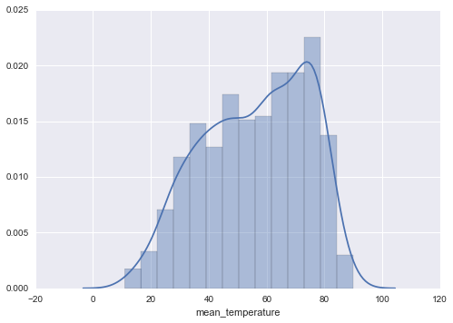
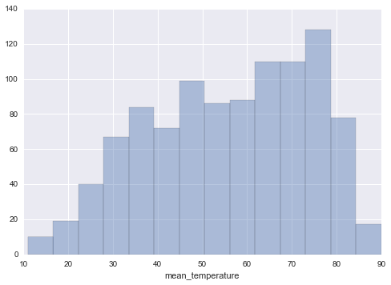
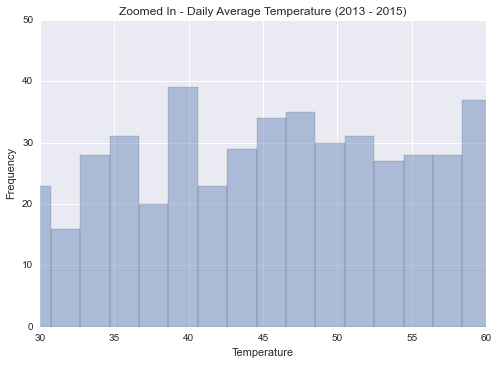
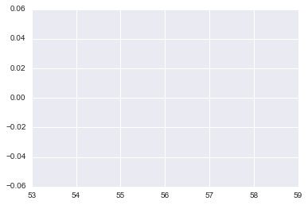
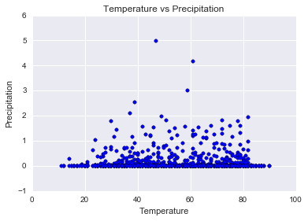
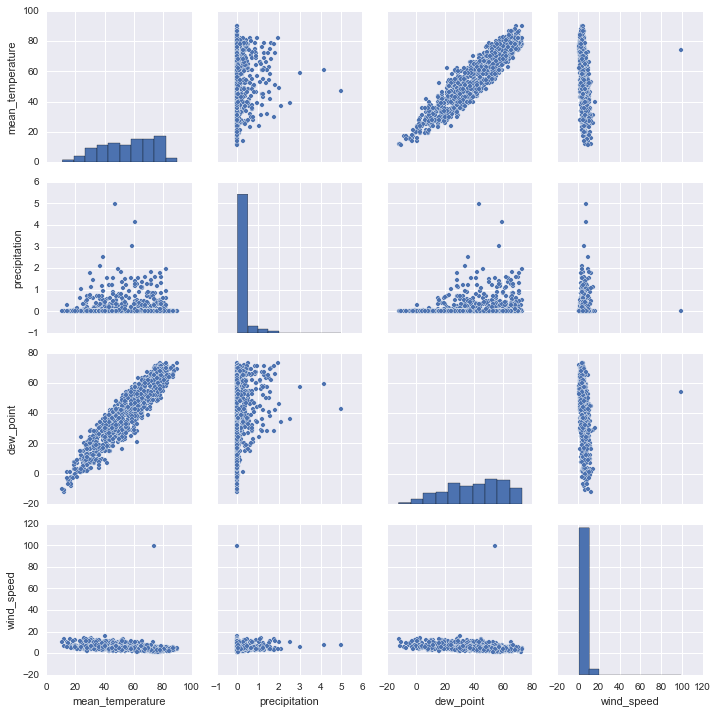

# Level 2: Exploring Data

(Find this notebook hosted [here](http://nbviewer.jupyter.org/github/kl2806/devfest-data-science-track/blob/master/level_2.ipynb).)

Before continuing on with level 2, make sure you've generated the `weather_data.csv` file we generated from level 1. This contains weather data from 2013 to 2015, and we'll be exploring that data within this level.

We'll now continue our data project by exploring the treasure trove of data we collected in level 1. This is also an overlooked but important part of data science; it helps us catch errors that may not have come up in the process of obtaining the data. Additionally, it gives us some intuition for the data, which is helpful when it comes to modeling.

`Pandas` is the workhorse of Python data analysis. Let's use it to slurp up our data in one shot:


```python
import pandas as pd

data = pd.read_csv('weather_data.csv')
```

The basic object that Pandas uses is called a "data frame". You can think of it essentially as a spreadsheet or a two-dimensional array. Each row of the spreadsheet is another data point, while each column is a variable.


```python
pd.options.display.max_rows = 7
data
```


<div>
<table border="1" class="dataframe">
  <thead>
    <tr style="text-align: right;">
      <th></th>
      <th>Month</th>
      <th>Day</th>
      <th>Year</th>
      <th>Mean Temperature</th>
      <th>Max Temperature</th>
      <th>Min Temperature</th>
      <th>Dew Point</th>
      <th>Average Humidity</th>
      <th>Maximum Humidity</th>
      <th>Minimum Humidity</th>
      <th>Precipitation</th>
      <th>Wind Speed</th>
      <th>Max Wind Speed</th>
      <th>Max Gust Speed</th>
    </tr>
  </thead>
  <tbody>
    <tr>
      <th>0</th>
      <td>1</td>
      <td>1</td>
      <td>2013</td>
      <td>33</td>
      <td>40</td>
      <td>26</td>
      <td>22</td>
      <td>54</td>
      <td>64</td>
      <td>44</td>
      <td>0.00</td>
      <td>7</td>
      <td>15</td>
      <td>26</td>
    </tr>
    <tr>
      <th>1</th>
      <td>1</td>
      <td>2</td>
      <td>2013</td>
      <td>28</td>
      <td>33</td>
      <td>22</td>
      <td>11</td>
      <td>48</td>
      <td>57</td>
      <td>39</td>
      <td>0.00</td>
      <td>6</td>
      <td>15</td>
      <td>22</td>
    </tr>
    <tr>
      <th>2</th>
      <td>1</td>
      <td>3</td>
      <td>2013</td>
      <td>28</td>
      <td>32</td>
      <td>24</td>
      <td>14</td>
      <td>56</td>
      <td>68</td>
      <td>43</td>
      <td>0.00</td>
      <td>5</td>
      <td>13</td>
      <td>20</td>
    </tr>
    <tr>
      <th>...</th>
      <td>...</td>
      <td>...</td>
      <td>...</td>
      <td>...</td>
      <td>...</td>
      <td>...</td>
      <td>...</td>
      <td>...</td>
      <td>...</td>
      <td>...</td>
      <td>...</td>
      <td>...</td>
      <td>...</td>
      <td>...</td>
    </tr>
    <tr>
      <th>1092</th>
      <td>12</td>
      <td>29</td>
      <td>2015</td>
      <td>40</td>
      <td>46</td>
      <td>34</td>
      <td>37</td>
      <td>87</td>
      <td>92</td>
      <td>82</td>
      <td>0.45</td>
      <td>7</td>
      <td>18</td>
      <td>24</td>
    </tr>
    <tr>
      <th>1093</th>
      <td>12</td>
      <td>30</td>
      <td>2015</td>
      <td>43</td>
      <td>48</td>
      <td>38</td>
      <td>39</td>
      <td>81</td>
      <td>86</td>
      <td>76</td>
      <td>0.19</td>
      <td>4</td>
      <td>9</td>
      <td>13</td>
    </tr>
    <tr>
      <th>1094</th>
      <td>12</td>
      <td>31</td>
      <td>2015</td>
      <td>45</td>
      <td>48</td>
      <td>42</td>
      <td>37</td>
      <td>71</td>
      <td>92</td>
      <td>49</td>
      <td>0.03</td>
      <td>5</td>
      <td>14</td>
      <td>20</td>
    </tr>
  </tbody>
</table>
<p>1095 rows × 14 columns</p>
</div>


Before going on, let's rename the columns to be lowercase and remove spaces. This is a standard practice to help remember the format of the column names (no more guessing whether it's "dew point" or "Dew point" or "Dew Point").


```python
data.columns = [name.lower().replace(" ", "_")
                for name in data.columns]
data
```


<div>
<table border="1" class="dataframe">
  <thead>
    <tr style="text-align: right;">
      <th></th>
      <th>month</th>
      <th>day</th>
      <th>year</th>
      <th>mean_temperature</th>
      <th>max_temperature</th>
      <th>min_temperature</th>
      <th>dew_point</th>
      <th>average_humidity</th>
      <th>maximum_humidity</th>
      <th>minimum_humidity</th>
      <th>precipitation</th>
      <th>wind_speed</th>
      <th>max_wind_speed</th>
      <th>max_gust_speed</th>
    </tr>
  </thead>
  <tbody>
    <tr>
      <th>0</th>
      <td>1</td>
      <td>1</td>
      <td>2013</td>
      <td>33</td>
      <td>40</td>
      <td>26</td>
      <td>22</td>
      <td>54</td>
      <td>64</td>
      <td>44</td>
      <td>0.00</td>
      <td>7</td>
      <td>15</td>
      <td>26</td>
    </tr>
    <tr>
      <th>1</th>
      <td>1</td>
      <td>2</td>
      <td>2013</td>
      <td>28</td>
      <td>33</td>
      <td>22</td>
      <td>11</td>
      <td>48</td>
      <td>57</td>
      <td>39</td>
      <td>0.00</td>
      <td>6</td>
      <td>15</td>
      <td>22</td>
    </tr>
    <tr>
      <th>2</th>
      <td>1</td>
      <td>3</td>
      <td>2013</td>
      <td>28</td>
      <td>32</td>
      <td>24</td>
      <td>14</td>
      <td>56</td>
      <td>68</td>
      <td>43</td>
      <td>0.00</td>
      <td>5</td>
      <td>13</td>
      <td>20</td>
    </tr>
    <tr>
      <th>...</th>
      <td>...</td>
      <td>...</td>
      <td>...</td>
      <td>...</td>
      <td>...</td>
      <td>...</td>
      <td>...</td>
      <td>...</td>
      <td>...</td>
      <td>...</td>
      <td>...</td>
      <td>...</td>
      <td>...</td>
      <td>...</td>
    </tr>
    <tr>
      <th>1092</th>
      <td>12</td>
      <td>29</td>
      <td>2015</td>
      <td>40</td>
      <td>46</td>
      <td>34</td>
      <td>37</td>
      <td>87</td>
      <td>92</td>
      <td>82</td>
      <td>0.45</td>
      <td>7</td>
      <td>18</td>
      <td>24</td>
    </tr>
    <tr>
      <th>1093</th>
      <td>12</td>
      <td>30</td>
      <td>2015</td>
      <td>43</td>
      <td>48</td>
      <td>38</td>
      <td>39</td>
      <td>81</td>
      <td>86</td>
      <td>76</td>
      <td>0.19</td>
      <td>4</td>
      <td>9</td>
      <td>13</td>
    </tr>
    <tr>
      <th>1094</th>
      <td>12</td>
      <td>31</td>
      <td>2015</td>
      <td>45</td>
      <td>48</td>
      <td>42</td>
      <td>37</td>
      <td>71</td>
      <td>92</td>
      <td>49</td>
      <td>0.03</td>
      <td>5</td>
      <td>14</td>
      <td>20</td>
    </tr>
  </tbody>
</table>
<p>1095 rows × 14 columns</p>
</div>


Data frames are kind of like dictionaries, where the keys are column names and the values is `Series` of data.


```python
data["dew_point"]
```


    0       22
    1       11
    2       14
            ..
    1092    37
    1093    39
    1094    37
    Name: dew_point, dtype: int64


These series work just like numpy arrays, supporting all the standard arithmetic and reductions operators:


```python
print(data["dew_point"].mean())
data["dew_point"] * 5
```

    40.2630136986


    0       110
    1        55
    2        70
           ... 
    1092    185
    1093    195
    1094    185
    Name: dew_point, dtype: int64


**Unlike** a dictionary, though, the `len` of a data frame is not the number of "keys" (columns). To get that, you need to do:


```python
print(len(data))
print(len(data.columns))
data.columns
```

    1095
    14


    Index(['month', 'day', 'year', 'mean_temperature', 'max_temperature',
           'min_temperature', 'dew_point', 'average_humidity', 'maximum_humidity',
           'minimum_humidity', 'precipitation', 'wind_speed', 'max_wind_speed',
           'max_gust_speed'],
          dtype='object')


You can also get both dimensions at once using `.shape`:


```python
data.shape
```


    (1095, 14)


You can also get rows of the data frame using the `.iloc` selector. There, the `.iloc` works like a list:


```python
data.iloc[0]
```


    month                1
    day                  1
    year              2013
                      ... 
    wind_speed           7
    max_wind_speed      15
    max_gust_speed      26
    Name: 0, dtype: object


```python
data.iloc[:5]
```


<div>
<table border="1" class="dataframe">
  <thead>
    <tr style="text-align: right;">
      <th></th>
      <th>month</th>
      <th>day</th>
      <th>year</th>
      <th>mean_temperature</th>
      <th>max_temperature</th>
      <th>min_temperature</th>
      <th>dew_point</th>
      <th>average_humidity</th>
      <th>maximum_humidity</th>
      <th>minimum_humidity</th>
      <th>precipitation</th>
      <th>wind_speed</th>
      <th>max_wind_speed</th>
      <th>max_gust_speed</th>
    </tr>
  </thead>
  <tbody>
    <tr>
      <th>0</th>
      <td>1</td>
      <td>1</td>
      <td>2013</td>
      <td>33</td>
      <td>40</td>
      <td>26</td>
      <td>22</td>
      <td>54</td>
      <td>64</td>
      <td>44</td>
      <td>0.00</td>
      <td>7</td>
      <td>15</td>
      <td>26</td>
    </tr>
    <tr>
      <th>1</th>
      <td>1</td>
      <td>2</td>
      <td>2013</td>
      <td>28</td>
      <td>33</td>
      <td>22</td>
      <td>11</td>
      <td>48</td>
      <td>57</td>
      <td>39</td>
      <td>0.00</td>
      <td>6</td>
      <td>15</td>
      <td>22</td>
    </tr>
    <tr>
      <th>2</th>
      <td>1</td>
      <td>3</td>
      <td>2013</td>
      <td>28</td>
      <td>32</td>
      <td>24</td>
      <td>14</td>
      <td>56</td>
      <td>68</td>
      <td>43</td>
      <td>0.00</td>
      <td>5</td>
      <td>13</td>
      <td>20</td>
    </tr>
    <tr>
      <th>3</th>
      <td>1</td>
      <td>4</td>
      <td>2013</td>
      <td>34</td>
      <td>37</td>
      <td>30</td>
      <td>19</td>
      <td>56</td>
      <td>63</td>
      <td>48</td>
      <td>0.00</td>
      <td>8</td>
      <td>18</td>
      <td>28</td>
    </tr>
    <tr>
      <th>4</th>
      <td>1</td>
      <td>5</td>
      <td>2013</td>
      <td>37</td>
      <td>42</td>
      <td>32</td>
      <td>19</td>
      <td>48</td>
      <td>56</td>
      <td>39</td>
      <td>0.00</td>
      <td>7</td>
      <td>17</td>
      <td>26</td>
    </tr>
  </tbody>
</table>
</div>


Great, we can now access whole regions of data using the appropriate syntax depending on whether we want rows or column. Let's now try programatically looking for subsets of the data. For example, say we only wanted the data that was recorded in the month of December.


```python
december_data = data[data.month == 12]
december_data[:5]
```


<div>
<table border="1" class="dataframe">
  <thead>
    <tr style="text-align: right;">
      <th></th>
      <th>month</th>
      <th>day</th>
      <th>year</th>
      <th>mean_temperature</th>
      <th>max_temperature</th>
      <th>min_temperature</th>
      <th>dew_point</th>
      <th>average_humidity</th>
      <th>maximum_humidity</th>
      <th>minimum_humidity</th>
      <th>precipitation</th>
      <th>wind_speed</th>
      <th>max_wind_speed</th>
      <th>max_gust_speed</th>
    </tr>
  </thead>
  <tbody>
    <tr>
      <th>334</th>
      <td>12</td>
      <td>1</td>
      <td>2013</td>
      <td>43</td>
      <td>49</td>
      <td>36</td>
      <td>29</td>
      <td>61</td>
      <td>76</td>
      <td>46</td>
      <td>0.00</td>
      <td>2</td>
      <td>7</td>
      <td>10</td>
    </tr>
    <tr>
      <th>335</th>
      <td>12</td>
      <td>2</td>
      <td>2013</td>
      <td>45</td>
      <td>49</td>
      <td>41</td>
      <td>34</td>
      <td>68</td>
      <td>82</td>
      <td>53</td>
      <td>0.00</td>
      <td>3</td>
      <td>8</td>
      <td>11</td>
    </tr>
    <tr>
      <th>336</th>
      <td>12</td>
      <td>3</td>
      <td>2013</td>
      <td>46</td>
      <td>53</td>
      <td>38</td>
      <td>34</td>
      <td>66</td>
      <td>86</td>
      <td>46</td>
      <td>0.00</td>
      <td>3</td>
      <td>8</td>
      <td>12</td>
    </tr>
    <tr>
      <th>337</th>
      <td>12</td>
      <td>4</td>
      <td>2013</td>
      <td>47</td>
      <td>52</td>
      <td>41</td>
      <td>36</td>
      <td>64</td>
      <td>73</td>
      <td>54</td>
      <td>0.00</td>
      <td>3</td>
      <td>8</td>
      <td>12</td>
    </tr>
    <tr>
      <th>338</th>
      <td>12</td>
      <td>5</td>
      <td>2013</td>
      <td>54</td>
      <td>60</td>
      <td>48</td>
      <td>50</td>
      <td>83</td>
      <td>93</td>
      <td>72</td>
      <td>0.01</td>
      <td>2</td>
      <td>9</td>
      <td>17</td>
    </tr>
  </tbody>
</table>
</div>


We can chain these conditions to ensure that multiple conditions are met. Let's try extracting data from May 2015.


```python
may_2015_data = data[(data.month == 5) & (data.year == 2015)]
may_2015_data[:5]
```


<div>
<table border="1" class="dataframe">
  <thead>
    <tr style="text-align: right;">
      <th></th>
      <th>month</th>
      <th>day</th>
      <th>year</th>
      <th>mean_temperature</th>
      <th>max_temperature</th>
      <th>min_temperature</th>
      <th>dew_point</th>
      <th>average_humidity</th>
      <th>maximum_humidity</th>
      <th>minimum_humidity</th>
      <th>precipitation</th>
      <th>wind_speed</th>
      <th>max_wind_speed</th>
      <th>max_gust_speed</th>
    </tr>
  </thead>
  <tbody>
    <tr>
      <th>850</th>
      <td>5</td>
      <td>1</td>
      <td>2015</td>
      <td>56</td>
      <td>63</td>
      <td>49</td>
      <td>39</td>
      <td>59</td>
      <td>71</td>
      <td>46</td>
      <td>0.00</td>
      <td>5</td>
      <td>14</td>
      <td>18</td>
    </tr>
    <tr>
      <th>851</th>
      <td>5</td>
      <td>2</td>
      <td>2015</td>
      <td>61</td>
      <td>74</td>
      <td>48</td>
      <td>40</td>
      <td>56</td>
      <td>80</td>
      <td>31</td>
      <td>0.00</td>
      <td>3</td>
      <td>15</td>
      <td>22</td>
    </tr>
    <tr>
      <th>852</th>
      <td>5</td>
      <td>3</td>
      <td>2015</td>
      <td>66</td>
      <td>80</td>
      <td>51</td>
      <td>38</td>
      <td>41</td>
      <td>59</td>
      <td>22</td>
      <td>0.00</td>
      <td>3</td>
      <td>10</td>
      <td>18</td>
    </tr>
    <tr>
      <th>853</th>
      <td>5</td>
      <td>4</td>
      <td>2015</td>
      <td>71</td>
      <td>85</td>
      <td>57</td>
      <td>44</td>
      <td>47</td>
      <td>72</td>
      <td>22</td>
      <td>0.00</td>
      <td>5</td>
      <td>15</td>
      <td>23</td>
    </tr>
    <tr>
      <th>854</th>
      <td>5</td>
      <td>5</td>
      <td>2015</td>
      <td>76</td>
      <td>85</td>
      <td>66</td>
      <td>50</td>
      <td>44</td>
      <td>53</td>
      <td>34</td>
      <td>0.00</td>
      <td>4</td>
      <td>13</td>
      <td>21</td>
    </tr>
  </tbody>
</table>
</div>


Now that we know how to explore the data, let's look at some techniques for summarizing the data in different columns. First up is the `dtypes` attribute.


```python
data.dtypes
```


    month              int64
    day                int64
    year               int64
                       ...  
    wind_speed        object
    max_wind_speed    object
    max_gust_speed    object
    dtype: object


This function seems simple because it just prints out the type of each column; however, it's useful if you spot something you don't expect. For example, we expect that `precipitation`, `wind_speed`, `max_wind_speed`, and `max_gust_speed` are all numeric types, but they are currently `object` types. Let's see if we can figure out what's going on. The `unique` function will show us all of the unique values of a particular column.


```python
data.precipitation.unique()
```


    array(['0.00', 'T', '0.55', '0.02', '0.09', '0.12', '0.69', '0.07', '0.22',
           '0.06', '0.04', '0.90', '1.15', '0.38', '0.49', '0.03', '0.15',
           '0.26', '0.01', '0.14', '1.56', '0.19', '0.56', '0.79', '0.60',
           '0.36', '0.17', '0.08', '0.63', '0.05', '3.02', '0.50', '1.09',
           '1.81', '0.30', '0.52', '0.85', '0.87', '0.13', '4.16', '0.48',
           '1.38', '1.26', '0.24', '0.84', '0.53', '0.23', '0.25', '0.31',
           '0.65', '0.46', '0.43', '1.60', '0.72', '0.45', '0.51', '1.98',
           '0.73', '1.20', '0.33', '0.29', '0.11', '0.10', '1.17', '1.43',
           '1.78', '0.16', '0.35', '0.92', '0.21', '0.34', '0.71', '4.97',
           '0.41', '0.37', '1.54', '0.91', '0.40', '1.28', '0.96', '0.39',
           '1.30', '0.62', '0.32', '1.18', '1.11', '1.51', '0.61', '0.20',
           '0.70', '1.24', '1.22', '2.54', '0.80', '2.10', '1.02', '0.67',
           '0.76', '0.81', '0.27', '1.37', '1.46', '0.57', '0.64', '1.12',
           '0.42', '1.95', '1.58', '1.08', '0.89', '1.40', '1.25', '1.21',
           '1.55'], dtype=object)


It looks like we found the problem! While most of the values are things we'd expect for a numeric column, we also have an odd one out: `'T'`. We can automatically convert the whole data frame to be numeric types using the handy `convert_objects` function. 


```python
clean_data = data.convert_objects(convert_numeric=True)
print(clean_data.dtypes)
clean_data.precipitation.unique()
```

    month               int64
    day                 int64
    year                int64
                       ...   
    wind_speed        float64
    max_wind_speed    float64
    max_gust_speed    float64
    dtype: object


    array([ 0.  ,   nan,  0.55,  0.02,  0.09,  0.12,  0.69,  0.07,  0.22,
            0.06,  0.04,  0.9 ,  1.15,  0.38,  0.49,  0.03,  0.15,  0.26,
            0.01,  0.14,  1.56,  0.19,  0.56,  0.79,  0.6 ,  0.36,  0.17,
            0.08,  0.63,  0.05,  3.02,  0.5 ,  1.09,  1.81,  0.3 ,  0.52,
            0.85,  0.87,  0.13,  4.16,  0.48,  1.38,  1.26,  0.24,  0.84,
            0.53,  0.23,  0.25,  0.31,  0.65,  0.46,  0.43,  1.6 ,  0.72,
            0.45,  0.51,  1.98,  0.73,  1.2 ,  0.33,  0.29,  0.11,  0.1 ,
            1.17,  1.43,  1.78,  0.16,  0.35,  0.92,  0.21,  0.34,  0.71,
            4.97,  0.41,  0.37,  1.54,  0.91,  0.4 ,  1.28,  0.96,  0.39,
            1.3 ,  0.62,  0.32,  1.18,  1.11,  1.51,  0.61,  0.2 ,  0.7 ,
            1.24,  1.22,  2.54,  0.8 ,  2.1 ,  1.02,  0.67,  0.76,  0.81,
            0.27,  1.37,  1.46,  0.57,  0.64,  1.12,  0.42,  1.95,  1.58,
            1.08,  0.89,  1.4 ,  1.25,  1.21,  1.55])


Great, it looks like the conversion did what we expected to for the data types, but it introduced this weird value of `nan`. We can drop the rows containing NAs out of the data frame using the `dropna` function.


```python
clean_data = clean_data.dropna()
```

Awesome, now that we have cleaned up our data, let's try using the `describe` function to get a better idea of what's going on in the data.


```python
pd.options.display.max_rows = 999
clean_data.describe().transpose()
```


<div>
<table border="1" class="dataframe">
  <thead>
    <tr style="text-align: right;">
      <th></th>
      <th>count</th>
      <th>mean</th>
      <th>std</th>
      <th>min</th>
      <th>25%</th>
      <th>50%</th>
      <th>75%</th>
      <th>max</th>
    </tr>
  </thead>
  <tbody>
    <tr>
      <th>month</th>
      <td>1008</td>
      <td>6.583333</td>
      <td>3.420686</td>
      <td>1</td>
      <td>4</td>
      <td>7</td>
      <td>10.00</td>
      <td>12.00</td>
    </tr>
    <tr>
      <th>day</th>
      <td>1008</td>
      <td>15.585317</td>
      <td>8.798791</td>
      <td>1</td>
      <td>8</td>
      <td>15</td>
      <td>23.00</td>
      <td>31.00</td>
    </tr>
    <tr>
      <th>year</th>
      <td>1008</td>
      <td>2014.009921</td>
      <td>0.818056</td>
      <td>2013</td>
      <td>2013</td>
      <td>2014</td>
      <td>2015.00</td>
      <td>2015.00</td>
    </tr>
    <tr>
      <th>mean_temperature</th>
      <td>1008</td>
      <td>56.093254</td>
      <td>18.044831</td>
      <td>11</td>
      <td>42</td>
      <td>58</td>
      <td>72.00</td>
      <td>90.00</td>
    </tr>
    <tr>
      <th>max_temperature</th>
      <td>1008</td>
      <td>63.052579</td>
      <td>18.898837</td>
      <td>18</td>
      <td>47</td>
      <td>65</td>
      <td>80.00</td>
      <td>98.00</td>
    </tr>
    <tr>
      <th>min_temperature</th>
      <td>1008</td>
      <td>48.629960</td>
      <td>17.503609</td>
      <td>2</td>
      <td>35</td>
      <td>50</td>
      <td>64.00</td>
      <td>83.00</td>
    </tr>
    <tr>
      <th>dew_point</th>
      <td>1008</td>
      <td>40.452381</td>
      <td>19.303506</td>
      <td>-12</td>
      <td>26</td>
      <td>43</td>
      <td>56.00</td>
      <td>73.00</td>
    </tr>
    <tr>
      <th>average_humidity</th>
      <td>1008</td>
      <td>59.195437</td>
      <td>13.629751</td>
      <td>27</td>
      <td>49</td>
      <td>58</td>
      <td>69.00</td>
      <td>96.00</td>
    </tr>
    <tr>
      <th>maximum_humidity</th>
      <td>1008</td>
      <td>75.399802</td>
      <td>14.968550</td>
      <td>39</td>
      <td>64</td>
      <td>76</td>
      <td>89.00</td>
      <td>100.00</td>
    </tr>
    <tr>
      <th>minimum_humidity</th>
      <td>1008</td>
      <td>42.499008</td>
      <td>14.828714</td>
      <td>11</td>
      <td>32</td>
      <td>40</td>
      <td>51.00</td>
      <td>92.00</td>
    </tr>
    <tr>
      <th>precipitation</th>
      <td>1008</td>
      <td>0.138919</td>
      <td>0.388731</td>
      <td>0</td>
      <td>0</td>
      <td>0</td>
      <td>0.06</td>
      <td>4.97</td>
    </tr>
    <tr>
      <th>wind_speed</th>
      <td>1008</td>
      <td>5.489087</td>
      <td>3.746151</td>
      <td>1</td>
      <td>4</td>
      <td>5</td>
      <td>7.00</td>
      <td>99.00</td>
    </tr>
    <tr>
      <th>max_wind_speed</th>
      <td>1008</td>
      <td>14.020833</td>
      <td>4.582962</td>
      <td>7</td>
      <td>12</td>
      <td>14</td>
      <td>16.00</td>
      <td>99.00</td>
    </tr>
    <tr>
      <th>max_gust_speed</th>
      <td>1008</td>
      <td>22.403770</td>
      <td>6.630005</td>
      <td>10</td>
      <td>18</td>
      <td>22</td>
      <td>26.00</td>
      <td>99.00</td>
    </tr>
  </tbody>
</table>
</div>


(The `transpose` function just turns any data frame sideways; here, it was done for readability.)

The reason that `describe` is so cool is that we get summary statistics for every single column. Everything seems okay, so let's get started on plotting the data to see even more patterns.

We'll be using the matplotlib and Seaborn packages within Python to plot data. Matplotlib is the standard plotting package in Python, but it's honestly kind of a pain to actually use. Seaborn is a nice wrapper for statistical plotting, with a much easier interface. It also makes really pretty pictures!

To start, we'll need the following few lines:


```python
%matplotlib inline
import matplotlib.pyplot as plt
import seaborn as sns
import numpy as np
```
**If you are using python in a text editor (such as Sublime Text) or in the Terminal rather than iPython notebook then disregard the `%matplotlib inline` command above and elsewhere in the tutorial. The plots will still render.**

```python
rs = np.random.RandomState(10)
d = rs.normal(size=100)
# sns.distplot(d, kde=False, color="b")
# np.histogram(d)
```


    (array([ 6,  3,  8, 15, 22, 20, 11,  9,  3,  3]),
     array([-2.13171211, -1.67177579, -1.21183948, -0.75190316, -0.29196684,
             0.16796947,  0.62790579,  1.08784211,  1.54777842,  2.00771474,
             2.46765106]))


```python
sns.distplot(clean_data.mean_temperature)
```


    ---------------------------------------------------------------------------

    TypeError                                 Traceback (most recent call last)

    <ipython-input-49-e9230350df36> in <module>()
    ----> 1 sns.distplot(clean_data.mean_temperature)
    

    /usr/local/lib/python3.5/site-packages/seaborn-0.6.0-py3.5.egg/seaborn/distributions.py in distplot(a, bins, hist, kde, rug, fit, hist_kws, kde_kws, rug_kws, fit_kws, color, vertical, norm_hist, axlabel, label, ax)


    /usr/local/lib/python3.5/site-packages/matplotlib/__init__.py in inner(ax, *args, **kwargs)
       1809                            "the matplotlib list!)")
       1810                     warnings.warn(msg % (label_namer, func.__name__),
    -> 1811                                   RuntimeWarning, stacklevel=2)
       1812             return func(ax, *args, **kwargs)
       1813         pre_doc = inner.__doc__


    /usr/local/lib/python3.5/site-packages/matplotlib/axes/_axes.py in hist(self, x, bins, range, normed, weights, cumulative, bottom, histtype, align, orientation, rwidth, log, color, label, stacked, **kwargs)
       5993             xmax = -np.inf
       5994             for xi in x:
    -> 5995                 if len(xi) > 0:
       5996                     xmin = min(xmin, xi.min())
       5997                     xmax = max(xmax, xi.max())


    /Users/kristyc/numpy/numpy/lib/function_base.py in histogram(a, bins, range, normed, weights, density)
        380 
        381         # Initialize empty histogram
    --> 382         n = np.zeros(bins, ntype)
        383         # Pre-compute histogram scaling factor
        384         norm = bins / (mx - mn)


    TypeError: 'numpy.float64' object cannot be interpreted as an integer





The `%matplotlib inline` is a special Jupyter magic, so see the note above if you aren't using IPython notebook. It only works on Jupyter clients (like the notebook or the IPython shell). It essentially just tells matplotlib to embed its graphs in the html of the notebook, instead of popping up in a new window.


```python
sns.distplot(clean_data.mean_temperature)
```


    ---------------------------------------------------------------------------

    TypeError                                 Traceback (most recent call last)

    <ipython-input-27-e9230350df36> in <module>()
    ----> 1 sns.distplot(clean_data.mean_temperature)
    

    /usr/local/lib/python3.5/site-packages/seaborn-0.6.0-py3.5.egg/seaborn/distributions.py in distplot(a, bins, hist, kde, rug, fit, hist_kws, kde_kws, rug_kws, fit_kws, color, vertical, norm_hist, axlabel, label, ax)


    /usr/local/lib/python3.5/site-packages/matplotlib/__init__.py in inner(ax, *args, **kwargs)
       1809                            "the matplotlib list!)")
       1810                     warnings.warn(msg % (label_namer, func.__name__),
    -> 1811                                   RuntimeWarning, stacklevel=2)
       1812             return func(ax, *args, **kwargs)
       1813         pre_doc = inner.__doc__


    /usr/local/lib/python3.5/site-packages/matplotlib/axes/_axes.py in hist(self, x, bins, range, normed, weights, cumulative, bottom, histtype, align, orientation, rwidth, log, color, label, stacked, **kwargs)
       5993             xmax = -np.inf
       5994             for xi in x:
    -> 5995                 if len(xi) > 0:
       5996                     xmin = min(xmin, xi.min())
       5997                     xmax = max(xmax, xi.max())


    /Users/kristyc/numpy/numpy/lib/function_base.py in histogram(a, bins, range, normed, weights, density)
        380 
        381         # Initialize empty histogram
    --> 382         n = np.zeros(bins, ntype)
        383         # Pre-compute histogram scaling factor
        384         norm = bins / (mx - mn)


    TypeError: 'numpy.float64' object cannot be interpreted as an integer





This simple plot just visualizes the distribution of the average temperature across all the days we collected data for; specifically, it plots the histogram (the bars) and an estimate of the distribution (the line). We can also just plot the histogram.


```python
sns.distplot(clean_data.mean_temperature, kde=False)
```


    ---------------------------------------------------------------------------

    TypeError                                 Traceback (most recent call last)

    <ipython-input-40-b9b95f4ef2e2> in <module>()
    ----> 1 sns.distplot(clean_data.mean_temperature, kde=False)
    

    /usr/local/lib/python3.5/site-packages/seaborn-0.6.0-py3.5.egg/seaborn/distributions.py in distplot(a, bins, hist, kde, rug, fit, hist_kws, kde_kws, rug_kws, fit_kws, color, vertical, norm_hist, axlabel, label, ax)


    /usr/local/lib/python3.5/site-packages/matplotlib/__init__.py in inner(ax, *args, **kwargs)
       1809                            "the matplotlib list!)")
       1810                     warnings.warn(msg % (label_namer, func.__name__),
    -> 1811                                   RuntimeWarning, stacklevel=2)
       1812             return func(ax, *args, **kwargs)
       1813         pre_doc = inner.__doc__


    /usr/local/lib/python3.5/site-packages/matplotlib/axes/_axes.py in hist(self, x, bins, range, normed, weights, cumulative, bottom, histtype, align, orientation, rwidth, log, color, label, stacked, **kwargs)
       5993             xmax = -np.inf
       5994             for xi in x:
    -> 5995                 if len(xi) > 0:
       5996                     xmin = min(xmin, xi.min())
       5997                     xmax = max(xmax, xi.max())


    /Users/kristyc/numpy/numpy/lib/function_base.py in histogram(a, bins, range, normed, weights, density)
        380 
        381         # Initialize empty histogram
    --> 382         n = np.zeros(bins, ntype)
        383         # Pre-compute histogram scaling factor
        384         norm = bins / (mx - mn)


    TypeError: 'numpy.float64' object cannot be interpreted as an integer


Neat! Let's add a title and some axis labels.


```python
sns.distplot(clean_data.mean_temperature, kde=False)
sns.plt.title('Daily Average Temperature (2013 - 2015)')
sns.plt.xlabel('Temperature')
sns.plt.ylabel('Frequency')
```


    ---------------------------------------------------------------------------

    TypeError                                 Traceback (most recent call last)

    <ipython-input-29-f54995eb4009> in <module>()
    ----> 1 sns.distplot(clean_data.mean_temperature, kde=False)
          2 sns.plt.title('Daily Average Temperature (2013 - 2015)')
          3 sns.plt.xlabel('Temperature')
          4 sns.plt.ylabel('Frequency')


    /usr/local/lib/python3.5/site-packages/seaborn-0.6.0-py3.5.egg/seaborn/distributions.py in distplot(a, bins, hist, kde, rug, fit, hist_kws, kde_kws, rug_kws, fit_kws, color, vertical, norm_hist, axlabel, label, ax)


    /usr/local/lib/python3.5/site-packages/matplotlib/__init__.py in inner(ax, *args, **kwargs)
       1809                            "the matplotlib list!)")
       1810                     warnings.warn(msg % (label_namer, func.__name__),
    -> 1811                                   RuntimeWarning, stacklevel=2)
       1812             return func(ax, *args, **kwargs)
       1813         pre_doc = inner.__doc__


    /usr/local/lib/python3.5/site-packages/matplotlib/axes/_axes.py in hist(self, x, bins, range, normed, weights, cumulative, bottom, histtype, align, orientation, rwidth, log, color, label, stacked, **kwargs)
       5993             xmax = -np.inf
       5994             for xi in x:
    -> 5995                 if len(xi) > 0:
       5996                     xmin = min(xmin, xi.min())
       5997                     xmax = max(xmax, xi.max())


    /Users/kristyc/numpy/numpy/lib/function_base.py in histogram(a, bins, range, normed, weights, density)
        380 
        381         # Initialize empty histogram
    --> 382         n = np.zeros(bins, ntype)
        383         # Pre-compute histogram scaling factor
        384         norm = bins / (mx - mn)


    TypeError: 'numpy.float64' object cannot be interpreted as an integer





That looks like a pretty fancy graph. Let's zoom in on a portion by setting the limits of the plot; we'll also change the bin size accordingly since we're looking at a portion of the plot.


```python
sns.distplot(clean_data.mean_temperature, kde=False, bins=40)
sns.plt.title('Zoomed In - Daily Average Temperature (2013 - 2015)')
sns.plt.xlabel('Temperature')
sns.plt.ylabel('Frequency')
sns.plt.xlim((30, 60))
sns.plt.ylim((0, 50))
```


    (0, 50)


These same functions that we've been using to edit the graph can be used more generally, but let's move on to move interesting graphs. Namely, let's try plotting the histograms of the average and maximum temperature on the same graph.


```python
sns.distplot(clean_data.mean_temperature, kde=False)
sns.distplot(clean_data.max_temperature, kde=False)
sns.plt.title('Daily Average and Max Temperature (2013 - 2015)')
sns.plt.xlabel('Temperature')
sns.plt.ylabel('Frequency')
```


    ---------------------------------------------------------------------------

    TypeError                                 Traceback (most recent call last)

    <ipython-input-31-80d81df35de0> in <module>()
    ----> 1 sns.distplot(clean_data.mean_temperature, kde=False)
          2 sns.distplot(clean_data.max_temperature, kde=False)
          3 sns.plt.title('Daily Average and Max Temperature (2013 - 2015)')
          4 sns.plt.xlabel('Temperature')
          5 sns.plt.ylabel('Frequency')


    /usr/local/lib/python3.5/site-packages/seaborn-0.6.0-py3.5.egg/seaborn/distributions.py in distplot(a, bins, hist, kde, rug, fit, hist_kws, kde_kws, rug_kws, fit_kws, color, vertical, norm_hist, axlabel, label, ax)


    /usr/local/lib/python3.5/site-packages/matplotlib/__init__.py in inner(ax, *args, **kwargs)
       1809                            "the matplotlib list!)")
       1810                     warnings.warn(msg % (label_namer, func.__name__),
    -> 1811                                   RuntimeWarning, stacklevel=2)
       1812             return func(ax, *args, **kwargs)
       1813         pre_doc = inner.__doc__


    /usr/local/lib/python3.5/site-packages/matplotlib/axes/_axes.py in hist(self, x, bins, range, normed, weights, cumulative, bottom, histtype, align, orientation, rwidth, log, color, label, stacked, **kwargs)
       5993             xmax = -np.inf
       5994             for xi in x:
    -> 5995                 if len(xi) > 0:
       5996                     xmin = min(xmin, xi.min())
       5997                     xmax = max(xmax, xi.max())


    /Users/kristyc/numpy/numpy/lib/function_base.py in histogram(a, bins, range, normed, weights, density)
        380 
        381         # Initialize empty histogram
    --> 382         n = np.zeros(bins, ntype)
        383         # Pre-compute histogram scaling factor
        384         norm = bins / (mx - mn)


    TypeError: 'numpy.float64' object cannot be interpreted as an integer


Whoa, cool plot alert! Let's add a legend to make sure someone looking at the plot knows which histogram is which.


```python
sns.distplot(clean_data.mean_temperature, kde=False, label="Average Temperature")
sns.distplot(clean_data.max_temperature, kde=False, label="Max Temperature")
sns.plt.title('Daily Average and Max Temperature (2013 - 2015)')
sns.plt.xlabel('Temperature')
sns.plt.ylabel('Frequency')
sns.plt.legend()
```


    ---------------------------------------------------------------------------

    TypeError                                 Traceback (most recent call last)

    <ipython-input-32-2e9b6d7626b8> in <module>()
    ----> 1 sns.distplot(clean_data.mean_temperature, kde=False, label="Average Temperature")
          2 sns.distplot(clean_data.max_temperature, kde=False, label="Max Temperature")
          3 sns.plt.title('Daily Average and Max Temperature (2013 - 2015)')
          4 sns.plt.xlabel('Temperature')
          5 sns.plt.ylabel('Frequency')


    /usr/local/lib/python3.5/site-packages/seaborn-0.6.0-py3.5.egg/seaborn/distributions.py in distplot(a, bins, hist, kde, rug, fit, hist_kws, kde_kws, rug_kws, fit_kws, color, vertical, norm_hist, axlabel, label, ax)


    /usr/local/lib/python3.5/site-packages/matplotlib/__init__.py in inner(ax, *args, **kwargs)
       1809                            "the matplotlib list!)")
       1810                     warnings.warn(msg % (label_namer, func.__name__),
    -> 1811                                   RuntimeWarning, stacklevel=2)
       1812             return func(ax, *args, **kwargs)
       1813         pre_doc = inner.__doc__


    /usr/local/lib/python3.5/site-packages/matplotlib/axes/_axes.py in hist(self, x, bins, range, normed, weights, cumulative, bottom, histtype, align, orientation, rwidth, log, color, label, stacked, **kwargs)
       5993             xmax = -np.inf
       5994             for xi in x:
    -> 5995                 if len(xi) > 0:
       5996                     xmin = min(xmin, xi.min())
       5997                     xmax = max(xmax, xi.max())


    /Users/kristyc/numpy/numpy/lib/function_base.py in histogram(a, bins, range, normed, weights, density)
        380 
        381         # Initialize empty histogram
    --> 382         n = np.zeros(bins, ntype)
        383         # Pre-compute histogram scaling factor
        384         norm = bins / (mx - mn)


    TypeError: 'numpy.float64' object cannot be interpreted as an integer





We're getting pretty good at this. Let's try plotting a scatterplot to see the relationship between temperature and precipitation.


```python
sns.plt.scatter(clean_data.mean_temperature, clean_data.precipitation)
sns.plt.title('Temperature vs Precipitation')
sns.plt.xlabel('Temperature')
sns.plt.ylabel('Precipitation')
```


    <matplotlib.text.Text at 0x117425f98>





This plot can help us think about the next step of modeling the data; it doesn't seem like temperature by itself will do a great job of predicting the amount of precipitation since there's a range of possible precipitation values for each temperature.

It'd be a hassle to do a scatterplot for every possible variable, but luckily, we can use the built in `pairplot` function. (We're only taking a few columns of the `clean_data` data frame though to keep things managable.)


```python
sns.pairplot(clean_data, vars=["mean_temperature", "precipitation", "dew_point", "wind_speed"])
```

    /usr/local/lib/python3.5/site-packages/matplotlib/__init__.py:892: UserWarning: axes.color_cycle is deprecated and replaced with axes.prop_cycle; please use the latter.
      warnings.warn(self.msg_depr % (key, alt_key))


    <seaborn.axisgrid.PairGrid at 0x117442dd8>





In this level, we looked at how to explore our data to make sure nothing's wrong with it and to start thinking about how to model precipitation. Once you're ready, we'll see you on the next level to start modeling the data.
